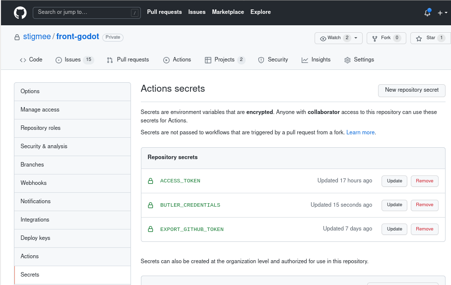

# Continuous integration and Deployement

We are using GitHub actions for automatically building Godot's project (coming soon Stigmee)
and deploying binaries (Linux, Mac OSX, Windows) to a server itch.io in which users can download them.

We have followed these instructions:
https://saltares.com/continuous-delivery-pipeline-for-godot-and-itch.io/

There are inportants steps concerning adding two tokens which are not so easy:
- On **your personnal GitHub settings**, create a "personal access token" https://github.com/settings/tokens. Click on "Generate new token" and select the buton "workflow (Update GitHub Action workflows)".

- On **your personnal itch.io settings**, find your Dvelopper API Key.
- On **the project GitHub settings**, create two secrets:
  - `EXPORT_GITHUB_TOKEN` holding your personal GitHub workflow token.
  - `BUTLER_CREDENTIALS` holding your personal itch.io API key.

GitHub actions are yaml files to be store in the folder `<your project>/.github/workflows/`. If you notice thes files refer to `uses: firebelley/godot-export@v1.1.0` and `josephbmanley/butler-publish-itchio-action@master` which are two external GitHub projects with the desired release (for example https://github.com/firebelley/godot-export).

For more information concernin GitHub actions: https://youtu.be/R8_veQiYBjI

## Creating an account on https://itch.io/

- Go to https://itch.io/ and create an account.
- Install the Linux client: https://itch.io/app download and install it `./itch-setup`.
I think it's mainly a browser, but for the few I used, it shows statistics on downloads.

