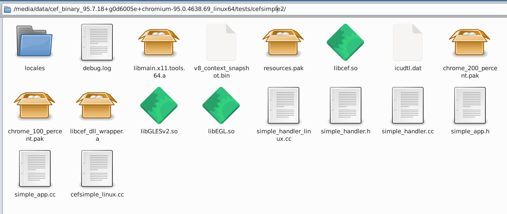
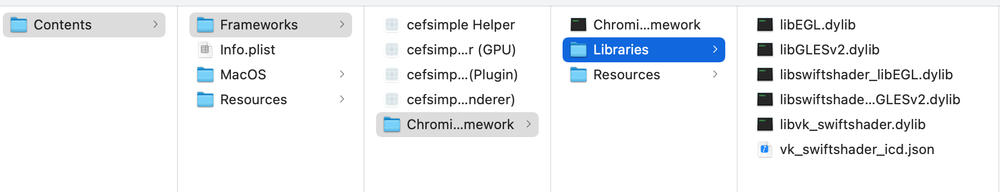

# Understanding Chromium Embedded Framework (CEF)

Let experiment with prebuilt CEF **alone** (meaning without Godot). We will
understand how the `cefsimple` application given in the `tests` folder is
compiled. This application demonstrates the minimal functionality required to
create a browser window. This is the minimal code source needed to embed inside
Godot. For its integration with Godot, please read the following [doc](tuto_modif_godot_fr.md).

These steps have been tested on Debian 11 64-bits and Ubuntu 18.04 64-bits.


Firstly, let name some folders. This will make our code shorter in this document. Do not forget to adapt the CEF version to your operating system with the desired version on https://cef-builds.spotifycdn.com/index.html:
```bash
TMP=/tmp
CEF_LINK=https://cef-builds.spotifycdn.com/cef_binary_96.0.14%2Bg28ba5c8%2Bchromium-96.0.4664.55_linux64.tar.bz2
CEF=$TMP/cef_binary_96.0.14+g28ba5c8+chromium-96.0.4664.55_linux64
CEF_TARBALL=$CEF.tar.bz2
CEFSIMPLE=$CEF/tests/cefsimple
CEFSIMPLE2=$CEF/tests/cefsimple2
```

Download and decompress it inside a temporary folder.
```bash
wget $CEF_LINK
tar jxvf $CEF_TARBALL
```

For later in this document, copy the `cefsimple` folder as `cefsimple2` and remove its `CMakeLists.txt` file:
```bash
cp -r $CEFSIMPLE $CEFSIMPLE2
rm -f $CEFSIMPLE2/CMakeLists.txt
```

## Cmake >= 3.19 is needed

On Debian 11, the cmake version is too old. You can look at this bash script to upgrade your cmake:
https://github.com/stigmee/doc/blob/master/doc/install_latest_cmake.sh

More information can be found at: https://trendoceans.com/how-to-install-cmake-on-debian-10-11/

## Compile chrome-sandbox, cefclient, cefsimple, ceftests

This compilation step is important not only for compiling examples but also because compiled packages
and library will be needed for the Stigmee project.

```bash
mkdir $CEF/build
cd $CEF/build
cmake -DCMAKE_BUILD_TYPE=Debug ..
make -j$(nproc)
# make -j$(nproc) cefclient cefsimple ceftests
```

You can also follow https://github.com/Zabrimus/cef-makefile-sample in where a `pkg-config` file is created making simpler
the integration of CEF inside other projects.

Now, let check if our compiled binaries are functional!

### cefsimple

This application demonstrates the minimal functionality required to create a browser window.

You can launch `cefsimple`:
```bash
./tests/cefsimple/Release/cefsimple
```

If you try to run the application `./cefsimple` it will show the Google page. Else you can provide your URL:
```
./cefsimple --url='https://cef-builds.spotifycdn.com/index.html'
```

### cefclient

This application demonstrates a wide range of CEF functionalities.

You can launch `cefclient`:
```bash
./tests/cefclient/Release/cefclient --use-views --load-extension=set_page_color
```

Note: there is a minor bug with CEF CMakefile: the folder `cefclient/resources/extensions/set_page_color/` is
not correctly copied inside the build folder `/build/tests/cefclient/Release/cefclient_files/` if you show this error
message, copy them manually:

```
[0211/111941.665199:ERROR:extension_util.cc(90)] Failed to load manifest from extensions/set_page_color/manifest.json
[0211/111941.762079:WARNING:extension_system.cc(139)] Failed to read extension manifest from set_page_color/manifest.json
```

### ceftests

Contains unit tests that exercise the CEF APIs.

You can launch `ceftests`:
```bash
 ./tests/ceftests/Release/ceftests
```

## Understanding how cefsimple is compiled

Since `cefsimple` is working, we no longer need it and we are using the copied folder `cefsimple2` and try to redo manually steps that cmake made for us, as seen in the previous section.

The application `cefsimple2` needs two local libs (one shared and one static) to be compiled:
- libcef.so (~1 Gb) already present within the tarball.
- libcef_dll_wrapper.a (~5 Mb) compiled thru cmake in the previous step.

The `libcef shared` library exports a C API that isolates the user from the CEF runtime and code base. The `libcef_dll_wrapper` project, which is distributed in source code form as part of the binary release, wraps this exported C API in a C++ API that is then linked into the client application.

Let copy them inside `cefsimple2`:
```bash
cp -v $CEF/Debug/libcef.so $CEF/build/libcef_dll_wrapper/libcef_dll_wrapper.a $CEFSIMPLE2
```

Let compile `cefsimple2` (c++ >= version 14 is needed). Since this example creates a X11 window, you'll need the X11 library `-lX11`:
```bash
g++ --std=c++14 -W -Wall -Wno-unused-parameter -DCEF_USE_SANDBOX -DNDEBUG -D_FILE_OFFSET_BITS=64 -D__STDC_CONSTANT_MACROS -D__STDC_FORMAT_MACROS -I$CEF -I$CEF/include cefsimple_linux.cc simple_app.cc simple_handler.cc simple_handler_linux.cc -o cefsimple2 ./libcef.so ./libcef_dll_wrapper.a -lX11
```

- The `-DNDEBUG` is for disabling the `#include <assert>` when compiled in release mode (See https://stackoverflow.com/a/5354352/8877076)
- The `-DCEF_USE_SANDBOX` is explained here https://bitbucket.org/chromiumembedded/cef/wiki/SandboxSetup and https://chromium.googlesource.com/chromium/src/+/refs/heads/main/docs/design/sandbox.md
- The `-D_FILE_OFFSET_BITS=64` is probably for working with files larger than 2Gb.
- The `-D__STDC_FORMAT_MACROS` is for https://www.cplusplus.com/reference/cinttypes/
- The `-I` are for searching header files in given folders.

Be sure your `LD_LIBRARY_PATH` is refering to the local folder (`.`), else add it (or save it insie your `~/.bashrc` file):
```bash
export LD_LIBRARY_PATH=.:$LD_LIBRARY_PATH
```

The other solution, more complex, is to update your `ld.so.conf.d` but I think the simplest solution will consit to modify the CMake to create a static library for libcef (`libcef.a`) to force loading symbols inside the binary.

If you try to run the application `./cefsimple2` it will halt. It needs some local packages. Let copy them (for the moment I do not know how they are compiled):
```bash
(cd $CEF/build/tests/cefsimple/Debug/
 cp -v icudtl.dat resources.pak chrome_100_percent.pak chrome_200_percent.pak v8_context_snapshot.bin $CEFSIMPLE2
)

mkdir -p $CEFSIMPLE2/locales
cp -v $CEF/build/tests/cefsimple/Debug/locales/en-US.pak $CEFSIMPLE2/locales
```

Summary files, from the CEF official documentation:
- chrome-sandbox: sandbox support binary.
- libcef.so: main CEF library.
- libcef_dll_wrapper.a: static library that all applications using the CEF C++ API must link against.
- icudtl.dat: unicode support data.
- cef.pak, devtools_resources.pak: non-localized resources and strings.
- natives_blob.bin, snapshot_blob.bin: V8 initial snapshot.
- locales/*.pak: locale-specific resources and strings.
- files/binding.html: cefclient application resources.

Here a screenshot of what you are supposed to have inside your folder:


If you try to run the application `./cefsimple2` it will show the Google page. Else you can provide your URL:
```
./cefsimple2 --url='https://cef-builds.spotifycdn.com/index.html'
```

I also copy:
```bash
cp $CEF/Debug/libGLESv2.so $CEF/Debug/libEGL.so $CEFSIMPLE2
```

To fix these errors:
```
[1122/222502.068976:ERROR:egl_util.cc(74)] Failed to load GLES library: ...
```

And I installed this system packages:
```bash
sudo apt-get install libxcb-sync-dev libxcb-dri3-dev libxcb-present-dev
```

To fix these errors:
```
[1122/222607.278155:WARNING:gpu_sandbox_hook_linux.cc(445)] dlopen(libxcb-dri3.so) failed with error: libxcb-dri3.so: Ne peut ouvrir le fichier d'objet partagé: Aucun fichier ou dossier de ce type
[1122/222607.278459:WARNING:gpu_sandbox_hook_linux.cc(447)] dlopen(libxcb-present.so) failed with error: libxcb-present.so: Ne peut ouvrir le fichier d'objet partagé: Aucun fichier ou dossier de ce type
[1122/222607.278567:WARNING:gpu_sandbox_hook_linux.cc(450)] dlopen(libxcb-sync.so) failed with error: libxcb-sync.so: Ne peut ouvrir le fichier d'objet partagé: Aucun fichier ou dossier de ce type
```

## Understanding how CEF starts its sub-processes

**Note:** For the moment we hardly understood CEF guts. The following
explanations in this document are probably false due to our poor understandings
of Chromium. They come from our understanding of the reading of the official
documentation and mainly on our numerous painful hours of failures.

The Official CEF documentation at
https://bitbucket.org/chromiumembedded/cef/wiki/Tutorial.md says:
- CEF uses multiple processes. The main application process is called the
  "browser" process. Sub-processes will be created for renderers, plugins, GPU,
  etc.
- On Windows and Linux the same executable can be used for the main process and
  sub-processes. On OS X you are required to create a separate executable and
  app bundle for sub-processes.
- Most processes in CEF have multiple threads. CEF provides functions and
  interfaces for posting tasks between these various threads.

Let traduce these sentences.

- For Linux, through any "activity monitor" applications able to show running
  processes, we can see all that the cefsimple process is not a single running
  process but several as shown in the following picture (TODO ADD picture):


- For Mac OS X, the following picture shows the content of the cefsimple
  application for Mac OS X compiled with the CMake command seen previously:



Let remind that a Mac OS X application is a special folder holding binaries and
resources. The main cefsimple binary is stored in `Contents/MacOS/` while the
others binaries (in fact they are another Mac applications) renderers, plugins,
GPU are stored in `Contents/Frameworks/`. Libraries are stored in
`Contents/Frameworks/Chromium Embedded Framework.framework/Libraries` and assets
are stored in Libraries are stored in `Contents/Frameworks/Chromium Embedded
Framework.framework/Resources`.

The documentation does not explain well how threads and processes are started
and how they are linked.  The following picture is the one found on this
[page](https://www.chromium.org/developers/design-documents/multi-process-architecture).
Processes are communicating through an inter-process communication (IPC) as
described
[here](https://www.chromium.org/developers/design-documents/inter-process-communication)


How all these processes are started and how to use them for inside Godot for the
Stigmee application ? The official documentation at
https://bitbucket.org/chromiumembedded/cef/wiki/GeneralUsage.md says in section
"Entry-Point Function" :
- **Single Executable:** When running as a single executable the entry-point
  function is required to differentiate between the different process types. The
  single executable structure is supported on Windows and Linux but not on
  MacOS.
- **Separate Sub-Process Executable:** When using a separate sub-process
  executable you need two separate executable projects and two separate
  entry-point functions.

Let rephrase these sentences. CEF can be embedded inside a C++ application
and started by one of the following ways:
- **Single Executable.** This is the simple way when the `int main(int argc,
  char** argv)` function of the host application is reachable. When Chromium is
  starting its forks, it forks this process and modifies the command line to
  give different behavior for each process.
- **Separate Sub-Process Executable:** if the `int main(int argc, char** argv)`
  function of the host application cannot be reached (or you are on Mac OS X),
  you have to launch another application which will access to its own main
  function and will be able to start Chromium and its forks through the command
  line as described in the first point.

Let remind that all C/C++ applications start from the `int main(int argc, char**
argv)` function. This function takes two arguments: `argc` and `argv` which hold
the command lines passed to the application when launched from a Linux
console. For example the following command line `myapplication --help`. The
`argv` is an array of strings holding all arguments as strings (even integers
are stored as strings). In our example the 0th argument is always the
application name `"myapplication"` and the 1st argument is `"--help"`. The
`argc` indicates the number of arguments (therefore the size of the array). In
our example 2.

### To start CEF from a single executable.

The documentation for `CefExecuteProcess` says:

```
This function should be called from the application entry point function to
execute a secondary process. It can be used to run secondary processes from
the browser client executable (default behavior) or from a separate
executable specified by the CefSettings.browser_subprocess_path value. If
called for the browser process (identified by no "type" command-line value)
it will return immediately with a value of -1. If called for a recognized
secondary process it will block until the process should exit and then return
the process exit code. The |application| parameter may be empty. The
|windows_sandbox_info| parameter is only used on Windows and may be NULL (see
cef_sandbox_win.h for details).
```

Let traduce this sentence. `CefExecuteProcess` forks the process of your host
application and starts another executable (Chromium or sub-process executable).
Forking a process consists to duplicate the whole current process (its memory,
its file descriptors, registers such as pointer counter ...) therefore you will
have two identical processes running the exact the same code source. They are
named `parent` (or `father`) and `child`. The parent process is your current
process and the child is newly duplicated process. To differentiate them and
make them running different code source the return code of the fork function
returns the process identifier. An *if-then-else* is used to switch the pointer
counter to execute different code source. See this example.

``` C++
int main()
{
    pid_t pid = fork();
    if (pid == -1)
    {
        // Error during the fork
        perror("fork");
        return EXIT_FAILURE;
    }
    else if (pid == 0)
    {
        // We are inside the child process
        printf("Mon PID est %i et celui de mon père est %i\n", getpid(),    getppid());
    }
    else
    {
        // We are inside the child parent
        printf("Mon PID est %i et celui de mon fils est %i\n", getpid(), pid);
    }
    return EXIT_SUCCESS;
}
```


`CefExecuteProcess` will block until the Chromium process ends and once Chromium
has done we immediately call `exit` to avoid calling the code of the parent
process. Chromium process will keep forking and therefore the same `int main(int
argc, char** argv)` function of our host application will be executed several
times. To differentiate the processes, CEF modifies the command line to give
orders to sub-processes. When the command line is not for a CEF process the
CefExecuteProcess returns -1 and in this case we do not kill the process.

Let see, what we did initially for Godot, inside the
`Godot/platform/x11/godot_x11.cpp` file. Note that for this case Godot also uses
the command line which is shared. To deal with this, we made a backup of the
command line before starting the process, then restoring the command line for
Godot.

```C++
int main(int argc, char** argv)
{
    // Backup command line is needed if the host application is also using
    // the command line with CEF. CEF is modifying it, so backup it to restore
    // values for the host.
    std::vector<std::string> backup_args;
    std::cout << ::getpid() << "::" << ::getppid() << ": "
              << __FILE__ << ": " << __PRETTY_FUNCTION__ << std::endl;
    for (int i = 0; i < argc; ++i)
    {
        std::cerr << "Before arg " << i << ": " << argv[i] << std::endl;
        backup_args.push_back(argv[i]);
    }

    // Call sub-process
    CefMainArgs args(argc, argv);
    int exit_code = CefExecuteProcess(args, nullptr, nullptr);
    if (exit_code >= 0)
    {
        // Sub proccess has ended, so exit this process
        exit(exit_code);
    }
    else if (exit_code == -1)
    {
        // If called for the browser process (identified by no "type" command-line value)
        // it will return immediately with a value of -1
    }

    // Restore command line since for the host application.
    std::cout << ::getpid() << "::" << ::getppid() << ": "
              << "[CEF_start] Apres CEF_start " << std::endl;
    for (int i = 0; i < argc; ++i)
    {
        std::cerr << "arg " << i << ": " << argv[i] << std::endl;
        argv[i] = &(backup_args[i][0]);
    }

    // Configurate Chromium
    CefSettings settings;
    settings.windowless_rendering_enabled = true;

#if !defined(CEF_USE_SANDBOX)
    settings.no_sandbox = true;
#endif

    bool result = CefInitialize(args, settings, nullptr, nullptr);
    if (!result)
    {
        std::cerr << "CefInitialize: failed" << std::endl;
        exit(-2);
    }

    // Code for the host application
    ...
}
```

### To start CEF from Separate Sub-Process Executable

While modifying the Godot source of Godot was functional (point of view) for
Linux architecture. The team preferred avoiding that but calling CEF from an
arbitrary function and for example, from the init of GDScript. Therefore we have
to use the second method: starting CEF from a separate sub-process executable.

A simple example not using Godot can be find here
https://github.com/Lecrapouille/OffScreenCEF/tree/master/cefsimple_separate

To achieve starting CEF from a separate sub-process executable, the code source
of the cefsimple has to be duplicated. The first cefsimple is a pure standalone
executable which can be run as it. It is named the `Separate Sub-Process
Executable`. The difference is that `CefExecuteProcess` and `CefInitialize` use
a pointer from an instance class deriving from `CefApp`. In the official
cefsimple when CEF wants to refresh the virtual callback method `onPaint` is
triggered but in this application we do not have to override it to display HTML
page (the process has builtin rendering). This application is run inside a
windows.

The primary process does not have to call `CefExecuteProcess` but just
`CefInitialize` in where a setting is referring to the path of the sub-process
executable to run. We also define code for configuring the sub-process as
off-screen process. The primary process override the virtual callback method
`onPaint` to display HTML with its personal method (SDL2, OpenGL, Godot).

### For Mac OS X

WIP

## Modifying cefsimple for OpenGL Core or SDL2

**Note:** modifying cefsimple for OpenGL Core or SDL2 was an intermediate step
for us to understand it better for its integration inside Godot or as Godot
module. Code can be find here https://github.com/Lecrapouille/OffScreenCEF

There are non-maintained GitHub repos to replace the libX11 by:
- SDL2: https://github.com/gotnospirit/cef3-sdl2
- OpenGL Core: https://github.com/if1live/cef-gl-example

These repos are outdated (> 4 years), they do not compile and when I run them they crashed because of an infinite loop forking the application and finally the system will fall down. I have updated them into https://github.com/Lecrapouille/OffScreenCEF (the OpenGL version needs a better conversion of key pressed between glfw3 types and CEF types). One of the main reason is the non respect of the logic:

```C++
int main(int argc, char* argv[])
{
  CefMainArgs main_args(argc, argv);

  // CEF applications have multiple sub-processes (render, plugin, GPU, etc)
  // that share the same executable. This function checks the command-line and,
  // if this is a sub-process, executes the appropriate logic.
  int exit_code = CefExecuteProcess(main_args, nullptr, nullptr);
  if (exit_code >= 0) {
    // The sub-process has completed so exit the application.
    return exit_code;
  }
```

`argc, argv` are used by CEF/Chromium when forking they are passing information

Explanation of the source code (OpenGL version) [cefsimple_opengl](https://github.com/Lecrapouille/OffScreenCEF/blob/master/cefsimple_opengl)

- [GLCore.hpp](https://github.com/Lecrapouille/OffScreenCEF/blob/master/cefsimple_opengl/GLCore.hpp) it's just a collection of static methods (hence functions in a namespace) as a help to OpenGL to compile shaders:
  - The [vertex shader](https://github.com/Lecrapouille/OffScreenCEF/blob/master/cefsimple_opengl/shaders/tex.vert), which launches for each summit. Its input `position` is the position of the vertices. `MVP` (model view projection) is to apply the rotation on the vertices. `Texcoord` is the positions of the texture on the vertices.
  - Le [fragment shader](https://github.com/Lecrapouille/OffScreenCEF/blob/master/cefsimple_opengl/shaders/tex.frag) this is the fragment shader: the colors of the rectangle come from the colors of the texture. We remove the transparent pixels.

- [GLWindow.hpp](https://github.com/Lecrapouille/OffScreenCEF/blob/master/cefsimple_opengl/GLWindow.hpp#) it is a class which encapsulates a classic window created by the lib glfw3 (method `init ()`) there are the classic private and virtual methods `setup ()` and `update ()` which are called by the method `start ()` and which allow the daughter class to implement the game init and the game update.

- [main.hpp](https://github.com/Lecrapouille/OffScreenCEF/blob/master/cefsimple_opengl/main.hpp#L184)
c'est la classe qui hérite de la fenetre GLWindow, ajoute/supprime des "browsers" CEF (ligne 217 `std::vector<std::shared_ptr<BrowserView>> m_browsers;`) et implemente les methodes `setup()` et `update()`.

- [main.hpp](https://github.com/Lecrapouille/OffScreenCEF/blob/master/cefsimple_opengl/main.hpp#L25)
c'est la classe qui encapsule 3 classes privées qui dérivent de l'API CEF: `CefRenderHandler` et `CefClient` (ligne 70 et 139). `BrowserView::RenderHandler::OnPaint` (ligne 100) est appellée par CEF quand il veut que l'on dessine. Cette classe contient tout l'artirail OpenGL: chargement + compilation, du shader + l'envoi du buffer CEF vers la texture OpenGL. La classe `BrowserView` encapsule tout ca.

- [main.cpp](https://github.com/Lecrapouille/OffScreenCEF/blob/master/cefsimple_opengl/main.cpp#L435) on demarre CEF qui lance tous ces forks.

- [main.cpp](https://github.com/Lecrapouille/OffScreenCEF/blob/master/cefsimple_opengl/main.cpp#L435)
je créé 2 browser avec leurs URL. Ligne 364 je définie où OpenGL doit dessiner sur la fenetre (c'est en pourcentage de la dimension de la fenetre). Donc j'ai demandé de dessiner sur 2 régions verticales. Ligne 368: bidouille pour dire au a la classe renderer de faire tourner la texture. Ligne 371 je créé des callbacks sur les événements de la fenetre: click souris, souris bouge, touche du clavier, redimensionnement de la fenetre. Les callbacks sont dés la ligne 8: reshape_callback ... elles dispatch les événements vers les browsers (et convertissent les types glfw3 vers CEF. D'ailleurs mon code pour le clavier est buggé).

- [main.cpp](https://github.com/Lecrapouille/OffScreenCEF/blob/master/cefsimple_opengl/main.cpp#L84 chargement du shader OpenGL) On crée un rectangle (2 triangles). On charge un shader pour chaque browser. https://github.com/Lecrapouille/OffScreenCEF/blob/master/cefsimple_opengl/main.cpp#L84 On dessine la texture dans le view port. https://github.com/Lecrapouille/OffScreenCEF/blob/master/cefsimple_opengl/main.cpp#L84 CEF nous demande le viewport qu'on lui envoie. https://github.com/Lecrapouille/OffScreenCEF/blob/master/cefsimple_opengl/main.cpp#L84 CEF nous envoie son image que l'on place dans la texture.

- [main.cpp](https://github.com/Lecrapouille/OffScreenCEF/blob/master/cefsimple_opengl/main.cpp#L397) c'est la fonction qui faudra remplacer car elle lit les messages et j'ai l'impression que c'est ca qui rend l'application peut reactive (clic souris ...) sinon lire une vidéo youtube est rapide (pas de temps de l'attence) mais le scrollbar d'une fenetre est super long.

Pour Godot on aura besoin du viewport: a gauche la scene 3D, à droite la page web (uniquement si on a cliquer sur un lien web). On n'aura pas besoin de shader OpenGL je pense qu'un sprite Godot devrait faire l'affaire.
