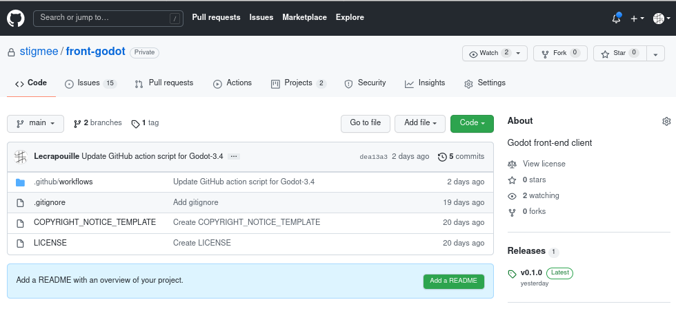
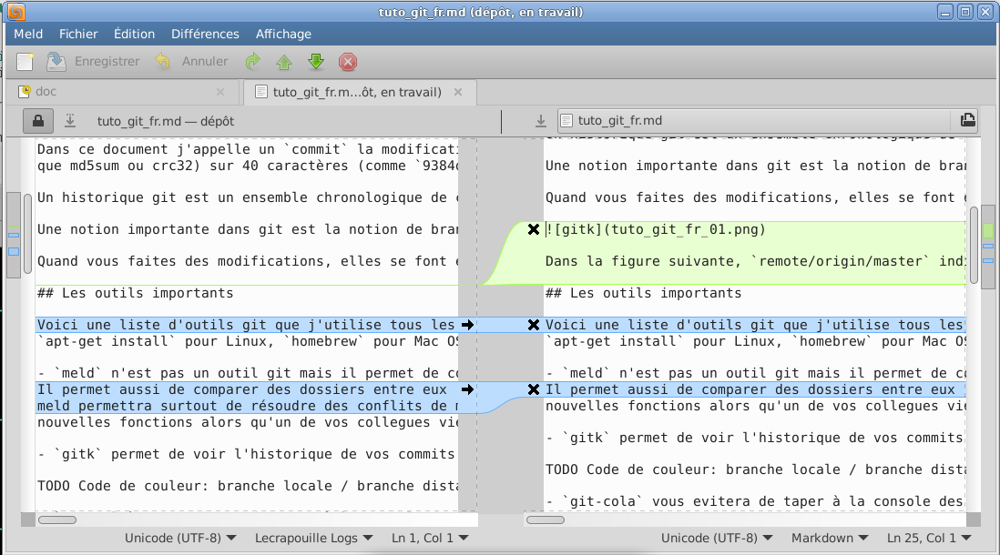
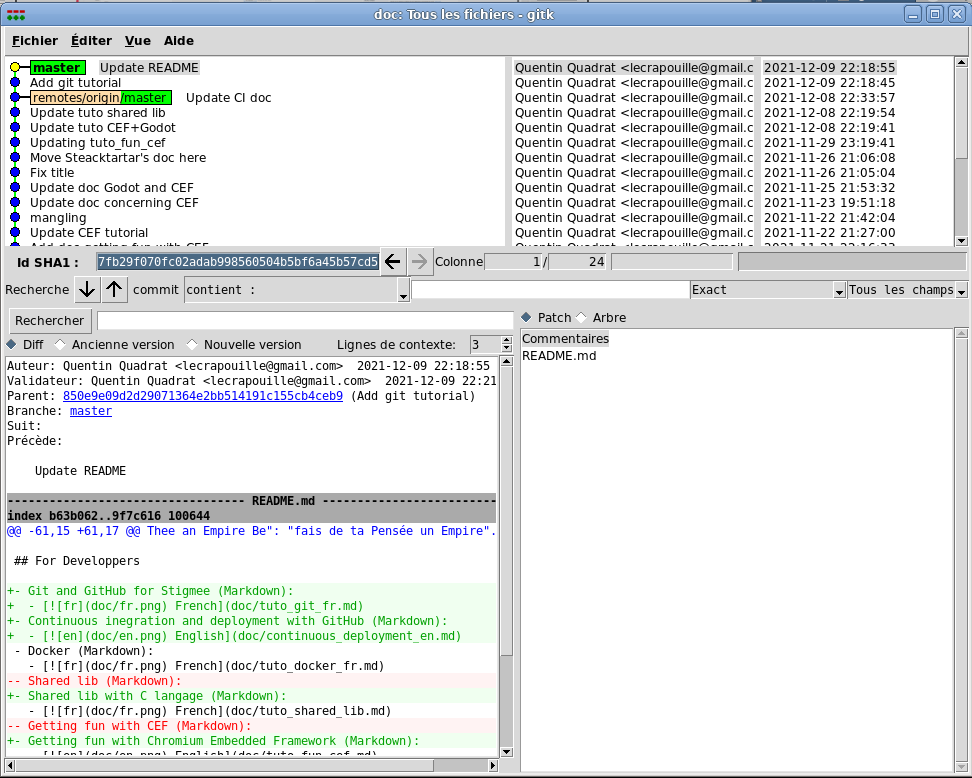
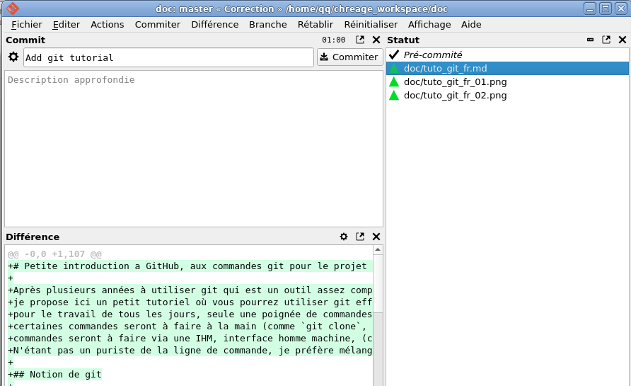
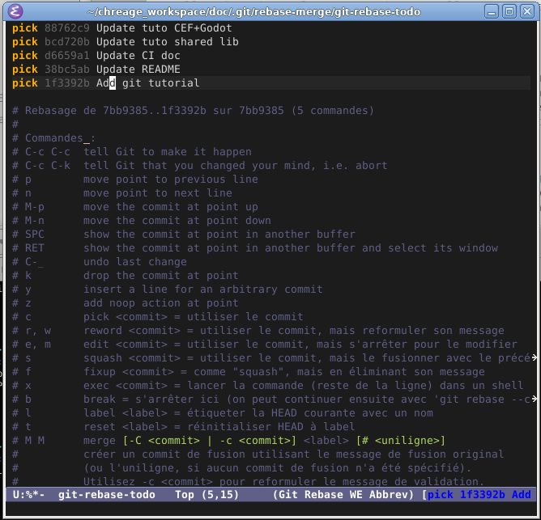
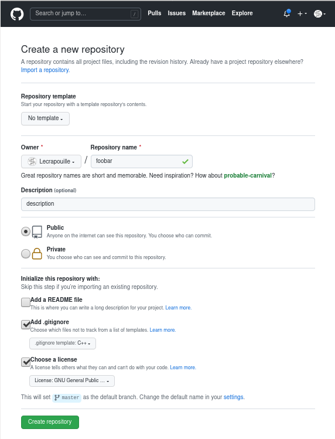
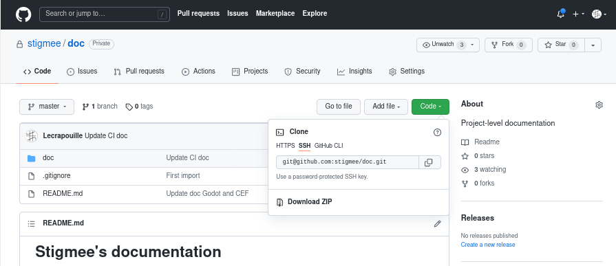

# Petite introduction à GitHub et aux commandes Git pour le projet Stigmee

Après plusieurs années à utiliser git (`connard` en Anglais, si si !), l'outil
de version le plus populaire actuellement, mais assez compliqué à appréhender
pour le novice, je vous propose un petit tutoriel sur les commandes et outils
les plus importants à connaître afin que vous puissiez utiliser git
rapidement. En effet, pour le travail de tous les jours, seule une poignée de
commandes est réellement nécessaire à connaître.  Certaines commandes seront à
faire à la main (comme `git clone`, `fetch`, `pull`, `rebase`), d'autres
commandes seront à faire via une IHM, interface homme machine, (comme `add`,
`push`, `cherry pick`). N'étant pas un puriste de la ligne de commande, je
préfère mélanger commandes manuelles et commandes via IHM pour plus de
souplesse.

Ce document est une présentation, l'idéal pour vous sera d'aller ensuite de
trouver la documentation liée à la commande qui vous intéresse, il y a de
nombreux documents sur internet comme
https://perso.liris.cnrs.fr/pierre-antoine.champin/enseignement/intro-git/.

## Motivation pour versionner vos fichiers

Dans un projet informatique, qu'il soit fait par une seule personne ou par un
ensemble de personnes, on aime garder un historique de nos modifications
passées, car en cas de régression (une fonctionnalité que l'on casse dans notre
logiciel en cours de développement), on souhaite pouvoir revenir en arrière et
retrouver l'état de notre code source avant la régression. De plus, si plusieurs
personnes travaillent ensemble on souhaite également avoir de la souplesse comme
éviter d'avoir des conflits dans les fichiers modifiés, permettent à des
personnes non connectées au serveur de gestion de continuer à travailler ...

On a tous fait un jour des sauvegardes sur un travail en cours avec des noms
comme `rapport.pdf`, `rapport-old.pdf`, `rapport-v1.pdf`,
`rapport-modif-toto-10decembre.pdf` puis quelques mois plus tard on s'est tous
posé la question mais quelle est la version la plus récente entre
`rapport-old.pdf` et `rapport-v1.pdf` ou bien est ce que `rapport-v1.pdf`
contient également l'ajout `toto` ? On se dit alors qu'un gestionnaire de
version serait important et c'est là qu'intervient git ! Développé par Linus
Torvalds afin de pallier le peu de souplesse qui offrait les gestionnaires de
version comme SVN ou CVS de l'époque. Git fut rapidement adopté par la
communauté des développeurs. SVN ou CVS ne doivent plus être utilisés car
devenus totalement préhistoriques.

## Apercu de GitHub

Des services apparurent comme GitHub, GitLab, Bitbucket permettant d'héberger
gratuitement vos projets publics ou privés. Du coup, ne confondez pas git l'outil
de version avec GitHub un hébergeur pour des projets git. Un dépôt
(`repository`) est un répertoire caché nommé `.git` contenant toutes les données
dont git a besoin pour gérer l'historique de vos modifications. Sauf cas
rarissimes, vous ne modifierez jamais son contenu directement, mais uniquement
en passant par les commandes git. En général 1 projet = 1 dépôt. Un projet peut
dépendre d'autres sous-projets, dans ce cas-là on les appelle des sous-modules
(`sub modules`).

GitHub est le plus ancien et donc le plus populaire hébergeur pour des projets
git, et ce, malgré son rachat par Microsoft qui a provoqué, à l'époque, des
protestations de développeurs et des migrations de projet vers GitLab (comme
Gtk+). GitHub permet de faire quelques commandes git pour vous dépanner mais il
reste avant tout un service d'hébergement.

### Organisation GitHub Stigmee

La page l'organisation github de Stigmee est
https://github.com/stigmee. Attention c'est une organisation privée avec des
projets privés. Il faut y être invité pour pouvoir les voir. L'index vers les
sous-parties de Stigmee est donné sur ce lien:
https://github.com/stigmee/Welcome

Quand vous cliquez sur un projet par exemple https://github.com/stigmee/front-godot
vous verrez ce genre de page:



- En haut, vous voyez *stigmee/front-godot* Stigmee est ici le nom de
 l'organisation (en général c'est le pseudo d'une personne physique),
 *front-godot* est le nom du dépôt git.

- A droite, vous voyez le nombre de personnes qui observent les évolution de ce
  projet, ainsi que le nombre de projets qui sont des clones du votre (pour
  fournir des correctifs via un pull request) et ainsi que le nombre d'étoiles
  (le nombre de fans qui aiment votre projet car GitHub proposant une page
  spéciale affichant tous vos projets favoris).

- En haut, un menu avec quelques onglets importants. Il faut cliquer dessus plus
  pour afficher la page associée qui donner plus d'informations :
  - `Issues` avec le nombre de tickets que des clients mécontents ont créés pour
    signaler un problème. C'est à votre équipe de les analyser pour les accepter
    ou les refuser.
  - `Pull` requests avec le nombre de correctifs en attente que votre équipe ou
    vos fans ont proposés. C'est à votre équipe de les analyser pour les accepter
    ou les refuser. Les commits acceptés seront mis dans la branche désignée.
  - `Actions` sont des automates que vous devez programmer afin de lancer des
    actions automatiques (workflow) tels que lancer des tests de non régression,
    de générer des releases, publier de la documentation ... en gros les taches
    répétitives, difficiles, longues et ingrates à faire.
   - `Projets` sont des post-its virtuels que les développeurs peuvent créer pour
     se souvenir des tâches à faire.
   - `Insight` contient un sous onglet qui affiche le nombres de vues sur votre
     projet ainsi que le nombre de téléchargements par jour.

- Au centre, le code source, vous pouvez vous baladez dans les répertoires et
  les fichiers du projets. En haut à gauche, les différentes branches git du
  projet. A droite en vert, le bouton pour télécharger votre projet.

- A droite, des informations sur le projet: description textuelle, licence, les
  releases à télécharger de votre projet et enfin les tags importants du projet.

## Notion de git

### Commit

Dans ce document, j'appelle un `commit` la modification/changement atomique d'un
ou plusieurs fichiers à un instant donné. Les fichiers ne sont pas
nécessairement du code source pour un projet informatique, mais doivent être
idéalement être du texte. Un commit ne contient que les lignes modifiées et non
le fichier dans son ensemble. C'est ce que l'on nomme un `patch`. Un patch
s'applique difficilement sur un fichier binaire (pdf, dll,
exécutables ...). Ceci nous rappelle pourquoi il est important de commiter de
préférence des fichiers textes. Si l'on désire commiter de (gros) fichiers
binaires, il faudra plutôt utiliser `git lfs` (que je ne maîtrise pas
encore). Une note pour les artistes Stigmee, les commits assets, dessins,
sons ... devraient donc être dissocié du code source afin de ne pas alourdir son
téléchargement. Donc, avoir deux dépôts séparés.

Un commit contient également un titre et une description textuelle des
modifications apportées donc des informations utiles pour vos collègues afin de
comprendre votre modification (ou vous en souvenir plusieurs mois après). Chaque
commit à un identifiant unique sur 40 caractères comme
`9384d10e23407cb2284dfb03e0a3cc38a02b73e8` appelé SHA1 (nom tiré de l'algorithme
du même gabarit que md5sum ou crc32). Chaque commit connaît le commit
précédent.

Une bonne pratique consiste à faire plein de petits commits plutôt
qu'un unique et gros commit contenant plusieurs changements. Donc 1 changement =
1 commit. Cela aidera à une meilleure compréhension de vos changements et vos
collègues arrêteront de vous traiter de *git* lors des revues de code.

### Historique

Un historique git est un ensemble chronologique de commits faits par
une ou plusieurs développeurs. C'est alors un ensemble de patchs qui sont
automatiquement appliqués les uns sur les autres (comme une pile d'assiettes).

### Branches locales et distantes

Une notion importante dans git est la notion de branches locales et de branches
distantes. Une branche contient un ensemble de commits. Par défaut une branche
principale nommée `master` (ou `main` sur GitHub pour des raisons
polito-sociales) est créée pour vous. Vous pouvez créer autant de branches que
vous le désirez. Elles peuvent être renommées et retravaillée (comme les arbres:
taillées, coupées).

Il y a différente stratégie pour gérer des branches, chacun à la sienne et
toutes se valent. Voici ma vision: en général `master` contient des `commit`
qui ne provoquent, idéalement, jamais de régressions, c'est une branche prête
pour créer des livrables (`releases`) de votre projet. Une branche `develop`
peut exister et contient le code instable qui peut provoquer des
régressions. Des branches `dev-ma-feature1`, `dev-ma-feature2` peuvent exister
afin qu'un développeur puisse sereinement développer une nouvelle fonctionnalité
au logiciel. Quand il aura fini il ira fusionner (`merge`) sa branche avec celle
de `develop`. Quand `develop` aura reçu plusieurs fonctionnalités, vous pouvez
la fusionner dans la branche `master`. Quand votre programme devient gros, vous
pouvez avoir à maintenir plusieurs versions de votre logiciel par exemple les
versions `v3.4` et `v4.0`. Git propose aussi des `tags` à savoir des étiquettes
pouvoir nommer un SHA1 particulier par exemple `v3.4-stable`. J'ai aussi
travailler avec des services comme [gerrit](https://www.gerritcodereview.com/),
que j'aime beaucoup, pour les revues de code et qui rend inutile le système de
branches.

### Commit et push

Quand vous faites des modifications sur les fichiers de votre projet, elles se
font en deux temps : d'abord vous les commitées sur votre branche `locale` à
savoir sur votre ordinateur (`git add <filename>` puis `git commit -m
"message"`) puis, dans un deuxième temps, quand un ensemble de commits vous
semble bons, vous pouvez les pousser (`git push`) sur le serveur distant (par
exemple GitHub). Vous pouvez retravailler autant de fois que vous le souhaitez
votre branche locale (`git rebase`) avant de les pousser sur la branche
distante. Mais une fois présents sur la branche distante (donc disponible sur le
serveur comme, par exemple, sur GitHub) il est mal vu d'y retravailler, car
d'autres personnes peuvent, entre temps, avoir récupéré vos modifications et
auront donc des conflits à résoudre dans votre code (qui aura changé par rapport
à eux). Git généralise l'idée de branche distante. Vous pouvez avoir plusieurs
serveurs distants et séparés. Ils auront des commits et des branches différents
(par exemple le serveur git de votre entreprise ou des serveurs de diverses
organisations). Ils pourront éventuellement être vus comme des locaux pour
d'autres serveurs distants (par exemple GitHub).

### Repository

Enfin git, vous permet de travailler sur plusieurs repository en même temps. Le
votre par défaut se nommera `origin` et le repo d'origine `upstream` (mis à
jour). Ceci par exemple vous permet de travailler sur un `fork` d'un projet
GitHub tout en traquant les modifications du projet d'origine.

## Les outils importants pour git

Voici une liste d'outils git que j'utilise tous les jours: `git`, `gitk`,
`git-cola`, `meld`, `emacs` (et son package magit.el). Ils s'installent via
`apt-get install` pour Linux, `homebrew` pour Mac OS X. gitk est directement
inclus avec git. Pour le package Emacs il vous faudra utiliser le serveur
MELPA. Vous pouvez évidement utiliser d'autres outils tel que git-gui, gitamine,
kraken ...

### Meld

`meld` n'est pas un outil git, mais il permet de comparer deux ou trois fichiers
et de les fusionner. Il permet aussi de comparer deux dossiers (récursion sur
les fichiers modifiés) mais aussi sur vos modifications git en cours (par
rapport au dernier commit). meld permettra surtout de résoudre des conflits de
merge (par exemple si vous étiez en train de modifier un fichier code source
pour ajouter de nouvelles fonctions alors qu'un de vos collègues vient de
commiter des modifications sur ce fichier et dans la même fonction que
vous). Une alternative à meld est `beyond compare` (mais sous licence payante).



Sur la figure suivante, à droite et en vert, des lignes ajoutées. En bleue des
lignes modifiées. Meld permet de remplacer des lignes désirées via la souris.
Mon conseil : je place toujours à gauche le fichier de référence et à droite le
fichier qui doit être modifié car sans cette convention il est facile de se
tromper sur qui est le fichier de référence à ne pas modifier (car meld indique
les noms des fichiers mais le nom des dossiers est masqué).

### Gitk

`gitk` permet de voir l'historique de vos commits sur votre branche actuelle
locale et distante. `gitk --all` permet de voir l'historique de vos commits sur
toutes les branches (locales et distantes). `gitk <filename>` permet de voir
l'historique pour ce seul fichier.

gitk est utile pour ajouter un tag sur un SHA1 particulier ou bien créer une
branche locale (ou temporaire afin de ne pas perdre un ensemble de commits si
vous désirez retravailler vos branches). Un dernier usage de gitk permet de
cueillir des cerises (cherry pick) à savoir récupérer un commit particulier (ou
plusieurs) d'une autre branche et de l'appliquer sur votre branche courante
(avec un risque de conflit de modifications qu'il faudra corriger via l'outil
meld). Une alternative à `gitk` est `gitamine` car il afficherait un graphe des
commits plus clair mais c'est un projet fait lors d'une thèse. Une alternative
est Kraken (que je n'utilise pas).



Dans la figure suivante, `remote/origin/master` indique le dernier état connu de
la branche `master` distante sur le repo nommé `origin` (qui est pour ce
document https://github.com/stigmee/doc). Le dernier commit a pour titre *Update
CI doc* alors que sur notre branche `master` locale nous avons faits deux
commits: *Add git tutorial* et *Update README*. Ce dernier a pour identifiant
unique SHA1 `7fb29f070fc02adab998560504b5bf6a45b57cd5`. En vert (+) et rouge (-)
le patch concernant l'unique fichier modifié README.md. En vert les lignes qui
ont été ajoutées alors qu'en rouge les lignes qui ont été supprimées.

### Git Cola

`git cola` (attention à la non présence du symbole `-` qui est uniquement
utilisé avec la commande `apt-get` pour l'installer) vous évitera de taper à la
console des commandes tel que `git add <filename>`, `git reset <filename>`, `git
commit -m "message de commit"` et `git push`: il suffira de cliquer sur le nom
des fichiers. git-cola permet aussi de commiter des portions de fichiers ce qui
est utile pour faire plusieurs petits commits "atomiques" et donc avoir un
contrôle plus fin sur vos modifications. Une fois les fichiers sélectionnés,
vous pouvez les commiter sur votre branche git locale (cela correspond à la
commande `git commit`). Il vous faudra avant mettre un titre à votre commit
ainsi qu'une description de vos modifications (afin d'aider vos collègues à
comprendre votre commit). Quand plusieurs commits ont été faits, vous pouvez les
pousser sur la branche distante. Pour cela il faut cliquer sur le menu `Action`
puis `Pousser`. Une fenêtre apparaîtra vous proposant de choisir le serveur et
la branche locale/distante. Cliquez ensuite sur le bouton `Pousser` (une
dernière fois madame).



Dans cette figure, à gauche et en haut le titre de votre commit, au milieu la
description textuelle du commit (ici vide), en bas l'affichage du patch. A
droite, les fichiers ajoutés (add) et prêts pour le git commit (via le bouton).

Si vous cliquez sur le bouton *commiter* et que vous avez réalisé que votre
commit contenait une erreur. Vous pouvez corriger votre dernier commit local via
`git cola --amend`. Une alternative à git cola est `git-gui` mais il est moins
pratique. git-cola permet aussi de commiter toutes vos commits locaux sur la
branche distante. Personnellement, je n'utilise plus que cet outil et ne tape
plus aucune commande dans la console.

### Emacs/Magit

Si vous voulez modifier des commits plus anciens sur votre branche locale
(supposons ici le 5ème en partant du dernier commit `HEAD~5`), git-cola ne
pourra pas vous aider (à ma connaissance) du coup taper dans la console `git
rebase -i HEAD~5` sera nécessaire. Cette commande ouvrira, dans mon cas, Emacs
qui, lui, appellera son package magit. Je suis tellement fan de magit que je ne
sais pas utiliser un autre outil. Par exemple, dans la figure suivante, je veux
retravailler sur les 5 derniers commits locaux.



Magit m'affiche les commits dans l'ordre inverse que ceux affichés par gitk et
me propose d'éditer mes commits en sélectionnant une action sur chaque ligne
référant à un commit. Les actions sont: -- ne rien faire, -- retravailler un
commit, -- changer un titre et description, -- fusionner ou changer l'ordre des
commits dans l'historique. Nous y reviendrons plus tard.

## Configuration de votre environnement de travail

Pour utiliser git, sinon il vous embêtera, il faut d'abord le configurer pour
ajouter votre nom et email en tapant dans une console bash :

```
git config --global user.name "John Doe"
git config --global user.email johndoe@example.com
```

On peut aussi le faire en éditant le fichier `~/.gitconfig` (). N'ayez pas peur
d'afficher votre véritable nom et adresse email afin que l'on puisse vous
contacter. GitHub, par défaut masquera votre adresse email mais pas votre nom
(une option dans vos settings GitHub à changer).

Pensez aussi à configurer tout de suite git-cola pour lancer vos éditeurs
préférés. Dans mon cas :
- éditeur de code : `emacs`
- Fusion de fichiers : `meld`.

git-cola va modifier votre fichier `~/.gitconfig`.

## Création d'un projet git

Se fait via la commande `git init` dans un dossier qui ne contient pas de
dossier caché `.git` mais le plus simple est de créer un repo depuis GitHub en
cliquant sur le bouton `+` puis `Create new repository` comme sur la figure
suivante :



- Ajouter une licence. Pour Stigmee ce sera `GNU General Public License v3.0`.

- Ajouter un fichier `.gitignore` prédéfini pour filtrer les fichiers à ne pas
commiter (vous ne les verrez plus apparaître dans git-cola). Par exemple :

```
*~
build/
*.o
```

Permet d'ignorer les commits de tous les fichiers de sauvegarde ayant pour
dernier caractère le symbole `~` (n'importe où dans les dossiers). De ne pas
prendre le dossier et son contenu `build`, de ne pas commiter les fichiers C
compilés (fichier objets).

- Ajouter un fichier README au format Markdown. Personnellement je ne coche
jamais cette case car je préfère le créer avec mon éditeur de texte préféré puis
de le commiter moi même (donc en deux temps).

## Git cloner, prendre en compte les modifications de vos collègues

Rapatrier le repository GitHub sur votre disque dur (s'il n'existe pas). Cliquez
sur le bouton vert comme sur la figure suivante :



**Ne jamais prendre le zip** car il ne contient pas le .git et ne contiendra pas
le code source des sous-modules git (si vous en avez créés). Deux options : git
clone via https ou via ssh. La seconde est la plus sure, c'est celle que
j'utilise mais nécessitera de créer une clef ssh sur votre ordinateur
https://docs.github.com/en/authentication/connecting-to-github-with-ssh/generating-a-new-ssh-key-and-adding-it-to-the-ssh-agent. La
première est plus simple pour tout ce qui est pour vos scripts shell et
procédures pour les intégrations continues. Si vous avez une clef ssh et que
vous avez git cloné via https, vous ne pourrez pas pousser vos commits git il
vous faudra changer l'url de votre repo (donc git clonez avec la bonne option) :

```
git clone git@github.com:stigmee/doc.git
```

Ajoutez l'option `--recurse` si le repo contient des sous-modules. Ayez le
réflexe immédiat de vous placer tout de suite dans la bonne branche !

`git clonee` n'est à faire une seule fois et à la condition que le dossier
n'existe pas là où vous avez décidé de le télécharger. Sinon, il suffit de
mettre à jour votre repo afin de suivre les modifications de vos collègues
(branches distantes). Faire :

```
git fetch --all
```

Pour mettre à jour les modifs des autres collègues avant de commiter sur la
branche distante, il faudra de temps en temps (mais surtout juste avant de
pousser vos modifs sur la branche distante) récupérer les modifications de vos
collègues sur votre branche locale:

```
git pull --rebase origin master
```

Où `master` sera à adapter par le nom de votre branche locale. Si vous avez des
conflits à résoudre :

```
git cola
```

Et dans la fenêtre, cliquez sur les fichiers en conflits et click souris pour
lancer meld.  Corrigez le conflit, qui si il est résolu, git cola mettra le
fichier en *pré-commité*.

## Branches

Pour voir toutes les branches (locales et distances) existantes ainsi que la
branche sur laquelle vous êtes actuellement placé :

```
git branch --all
```

Pour créer et sauter sur une nouvelle branche:
```
git branch -b ma-nouvelle-branche
```

Pour sauter sur une autre branche:
```
git branch mon-autre-branche
```

Pour rappel, le but des branches est de permettre aux développeurs de travailler
sur leurs *features* tranquillement dans leur coin (un travail qui peut prendre
des semaines/mois) sans avoir de conflits directs avec ses collègues concernant
des fichiers modifiés. A la fin du travail il faut fusionner (merge) les
branches. Supposons que vous êtes sur la branche `develop` et que vous voulez
merger la branche `dev-feature1` :

```
git merge --ff dev-feature1
```

Ou bien :

```
git merge --no-ff dev-feature1
```

La différence d'option est .

## Modifier votre code, branche locale et branche distante

Le plus simple est d'utiliser :
- `git cola` pour commiter vos modifications locales (bouton `commiter`) puis
  distantes (bouton `pousser`). Il est préférable de ne pas commiter l'ensemble
  en un unique et énorme commit. Préférez plusieurs petits commit. Pour cela cliquer
  sur les fichiers *modifiés* désirés pour les passer à *pré-commités*. Vous pouvez
  aussi sélectionner des bouts de fichiers à commiter  via la souris (voir retirer vos
  modifications). Commitez les fichiers *pré-commités*. Recommencez l'opération pour
  un autre commit jusqu'à ce que tous vos fichiers soient commités. Vous pouvez ne pas
  prendre en compte un fichier et via la souris le faire revenir dans son état précédent.
- `git cola --amend` pour corriger votre dernier commit.
- `git rebase -i HEAD~5` pour corriger les commits parmi les 5 derniers. `git
rebase -i --root` pour corriger le premier commit. Cela appellera, chez moi,
Emacs. Editez les commandes pour chaque commit avec les touches suivantes :
 - `e` (edit) pour modifier les fichiers commités (en combinaison avec `git cola
   --amend` pour la modification).
 - `r` (reword) pour modifier le titre ou le commentaire.
 - `k` (kill) pour supprimer un commit.
 - `s` (squash) pour fusionner le commit avec le commit parent (celui qui est une
   ligne au-dessus).
 - `p` et `n` pour changer l'ordre des commits (attention aux possibles conflits
   qui faudra gérer via l'outil meld ou bien abandonné en tapant `git rebase
   --abord`).

Après chaque fichier retravaillé, il faut taper `git rebase --continue` dans la
console pour travailler sur le commit suivant. En cas de soucis tapez `git
rebase --abort` pour revenir dans l'état d'avant votre tentative de rebase.

Vous avez plein de modifications locales et que vous voulez faire un rebase, git
refuse, car vous perdriez vos modifications non sauvegardées. Commitez les ou
bien faites une sauvegarde :
```
git stash
```

Puis, pour les récupérer:
```
git stash
```

## Reset et blame

Vous avez fait n'importe quoi (plein de commits locaux), vous voulez vous
remettre dans l'état original. Via gitk, créer une branche temporaire par
sécurité (sinon gitk ne l'affichera plus) puis faites un:

```
git reset
```

ou bien revenir sur le bon SHA1:

```
git reset --hard <SHA1>
```

Vous venez de perdre vos modifs ? Vous allez vous immoler sur votre bureau en
guise de protestation ? Avant de craquer l'allumette, sachez que git sauvegarde
son état après chaque commande. Du coup tentez un :

```
git reflog
```

suivi d'un:
```
git reset --hard <SHA1>
```

Avec le SHA1 qu'il vous aura proposé afin de retrouver l'état initial désiré.
Sauvé ? Gardez vos allumettes et votre jerrycan pour trouver quelqu'un d'autre
car nous allons trouver un développeur fautif sur la dernière régression
constatée par l'équipe de validation :

```
gitk <fichier>
git blame <fichier>
```

La première commande, vous montre l'historique du fichier désiré. La deuxième
montre le contenu du fichier où chaque ligne affiche également le SHA1 et le nom
de la dernière personne qui a modifié la ligne. Vous avez trouvé le fautif ? Si
oui alors j'ai ricane, sinon voici une autre commande pour retrouvez votre le
commit fautif en se basant se la recherche par dichotomie :

```
git bisect
```

git vous demandera un commit où votre programme fonctionne et un autre commit où
votre programme ne fonctionne plus. Par itération dichotomique et via gitk, vous
allez tester par dichotomie les commits et vous rapprocher de votre future
victime en log(n) itérations.

## GitHub Pull request

Permet d'éviter de commiter directement dans le projet mais va proposer une page
GitHub intermédiaire (onglet pull request) qui permettra de faire un "code
review" à savoir une revue de code : le(s) responsable(s) du projet valideront le
commit et l'auteur pourra reprendre sont travail jusqu'à son acceptation. Un des
auteurs commitera les modifications avec la possibilité d'options comme la
fusion des commits intermédiaires, un merge ...

Pour cela il faut cloner le repository GitHub (bouton `fork`), commiter vos
modifications sur votre nouveau repository cloné puis sur GitHub cliquer sur le
bouton "proposer un pull request", de préférence évitez de commiter sur la
branche `master` du projet (sait on jamais une régression est si vite arrivée)
mais sur une branche temporaire (`dev-xxx`), le propriétaire saura sur quelle
branche l'appliquer.

## Remote

Si vous avez cloné un projet GitHub et que vous voulez suivre les évolutions du
projet parent pour éventuellement proposer d'autres pull request:

```
git remote add upstream URL
```

Où `URL` est l'url du projet parent GitHub et `upstream` à remplacer par le nom
désiré du repo parent.

```
git remote -v
git fetch --all
```
